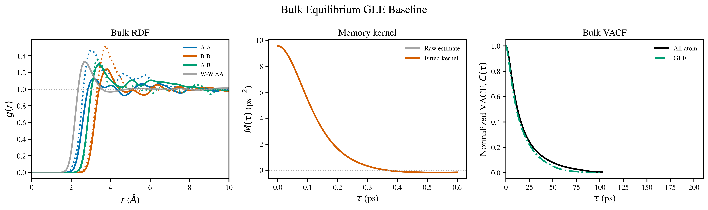
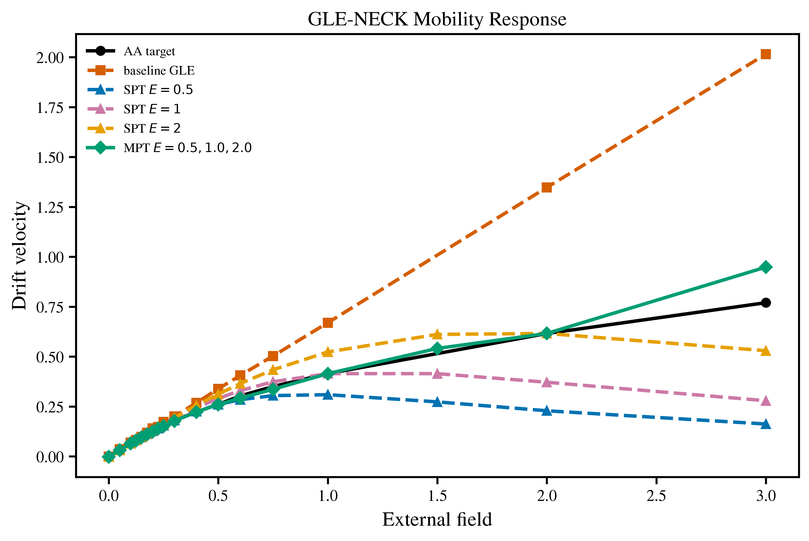
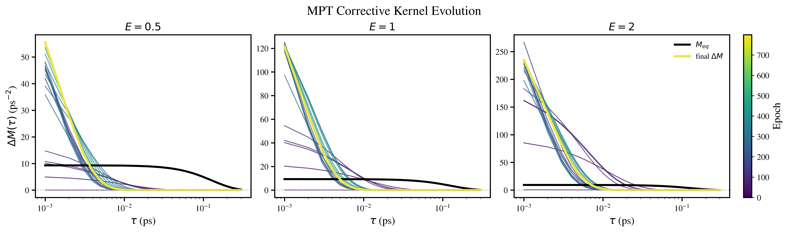

# GLE-NECK

**Generalized Langevin Equation with Non-Equilibrium Corrective Kernel**

[](https://www.python.org/)
[](LICENSE)
[](#status)

<p align="center">
  
</p>

GLE-NECK is a differentiable coarse-grained transport workflow for learning field-dependent corrections to an equilibrium generalized Langevin equation (GLE). This public repository focuses on the **bulk binary-solute system**: explicit-solvent reference simulations define equilibrium structure, equilibrium dynamics, and driven mobility targets; a retained-solute GLE reproduces equilibrium RDF/VACF behavior; GLE-NECK then learns a non-equilibrium corrective memory kernel from drift-velocity targets.

The repository is designed for reproducibility from compact processed artifacts. Raw trajectories, exploratory notebooks, large run directories, and private cluster output are intentionally excluded.

## Model

The retained coarse-grained model propagates only solute species `A` and `B`; the solvent is eliminated and represented through conservative interactions, memory friction, colored noise, and a learned correction:

```text
F_GLE-NECK = F_PMF - int_0^t [M_eq(t - tau) + Delta M(E, t - tau)] v(tau) d tau
             + eta(t) + F_ext

Delta M(E, tau) = E^2 N_theta(E, tau)
```

The `E^2` gate enforces smooth recovery of the equilibrium GLE as the external field approaches zero.

## Main Results

Generate the complete bulk figure set with:

```bash
python scripts/make_bulk_figures.py --all
```

The generated figures are written to `figures/bulk/` as both PNG and PDF:

| Figure | Purpose |
| --- | --- |
| `01_aa_equilibrium_targets` | AA RDF targets, including solvent-solvent diagnostic RDF, and IBI/PMF solute potentials |
| `02_gle_baseline_benchmark` | Baseline GLE RDF, memory kernel, and VACF validation |
| `03_baseline_mobility` | AA mobility target versus equilibrium GLE response |
| `04_spt_vs_mpt_loss` | Single-point and multi-point corrective-kernel training losses |
| `05_spt_vs_mpt_mobility` | AA, baseline GLE, SPT, and MPT mobility curves |
| `06_mpt_kernel_evolution_logtau` | MPT corrective-kernel evolution on a logarithmic lag-time axis |
| `07_field_conditioned_kernel` | Final corrective kernel as a function of field strength |

After generation, the key panels appear here:

<p align="center">
  
</p>

<p align="center">
  
</p>

<p align="center">
  
</p>

## Installation

For artifact-backed figure reproduction and tests:

```bash
git clone https://github.com/ishannadkarni1997/GLE-NECK.git
cd GLE-NECK
python3 -m venv .venv
. .venv/bin/activate
python -m pip install --upgrade pip
python -m pip install -e '.[dev]'
```

For full differentiable simulations and training, install the optional JAX stack in an environment appropriate for your CPU/GPU platform:

```bash
python -m pip install -e '.[dev,jax]'
```

## Reproducibility

Regenerate figures:

```bash
python scripts/make_bulk_figures.py --all
```

Run artifact and repository checks:

```bash
python scripts/check_bulk_reproducibility.py
```

Run tests:

```bash
pytest
```

The same entry points are also available after installation:

```bash
gleneck-bulk-figures --all
gleneck-bulk-check
```

## Repository Layout

```text
src/gleneck/                 reusable Python package
scripts/                     public command-line workflows
configs/                     locked bulk run configuration
data/processed/bulk/         compact processed artifacts
figures/bulk/                generated public figures
docs/                        method, units, provenance, and cluster notes
examples/                    minimal reproduction workflow
slurm/                       generic GPU job template
tests/                       artifact, plotting, and hygiene tests
```

## Data Policy

Committed data are limited to compact processed artifacts required to reproduce the public figures and smoke tests. The repository does not include raw trajectories, position/velocity histories, scheduler logs, failed training branches, or draft manuscript materials. Those files should be archived separately for formal publication if needed.

## Status

The bulk workflow is the maintained public path. The promoted GLE-NECK result uses a neural/asymptotic corrective kernel trained at `E = 0.5, 1.0, 2.0` with `l_max = 500`. The learned correction reproduces the selected mobility regime well but decays faster than the audited equilibrium memory kernel; this is documented as a current modeling caveat rather than hidden in the implementation.

## Citation

If this code is useful, please cite the associated thesis or manuscript when available. A placeholder citation file is provided in [`CITATION.cff`](CITATION.cff).
