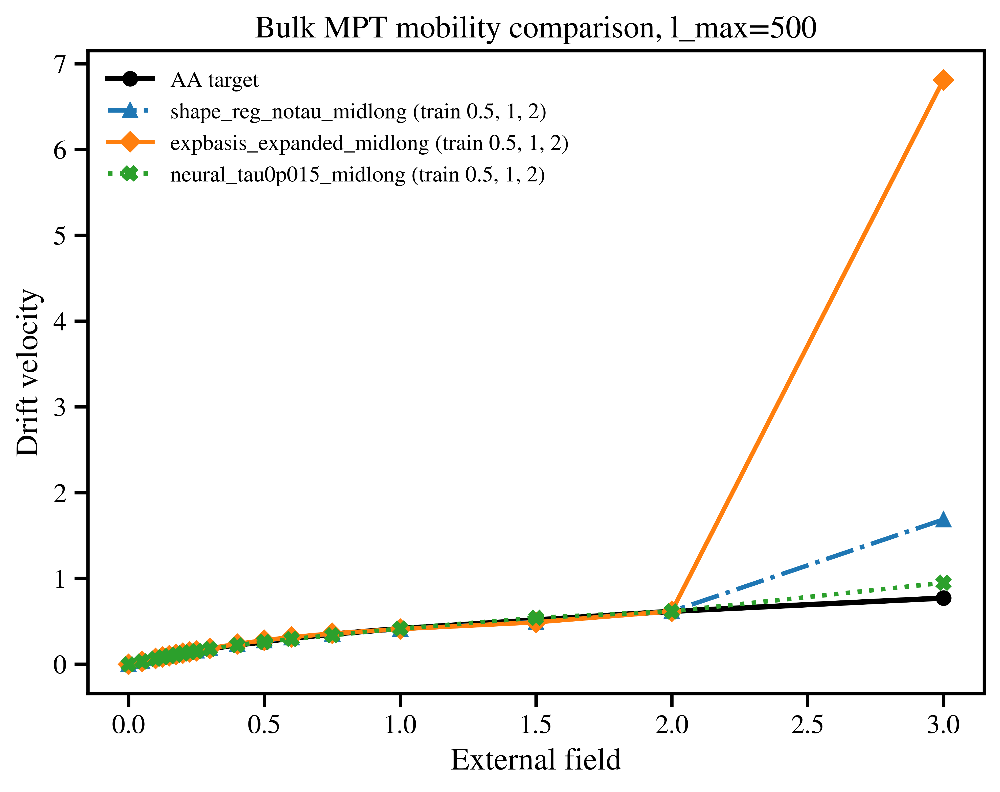
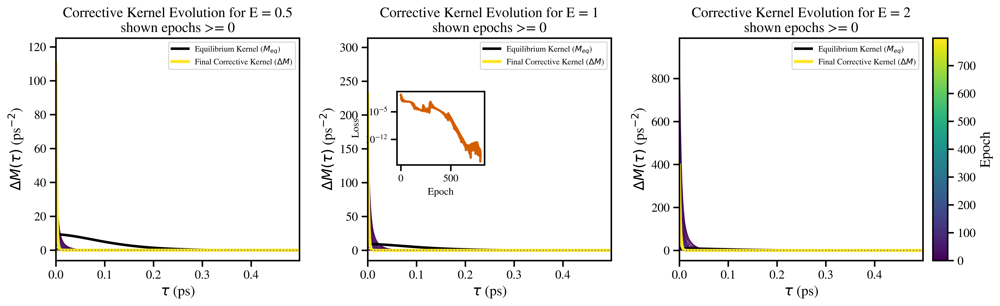

# GLE-NECK

**Generalized Langevin Equation with Non-Equilibrium Corrective Kernel**

[](https://www.python.org/)
[](LICENSE)
[](#project-status)

<p align="center">
  
</p>

GLE-NECK is a differentiable coarse-grained transport framework for learning non-equilibrium corrections to an equilibrium generalized Langevin equation (GLE). The central use case is a system where an equilibrium coarse-grained GLE reproduces static structure and equilibrium time correlations, but does not reproduce the all-atom drift response under external driving.

This repository contains a cleaned, publication-oriented implementation for the bulk transport workflow, compact processed artifacts, and scripts for reproducing the current thesis/manuscript figures. Raw trajectories, exploratory notebooks, draft PDFs, private cluster paths, and large diagnostic runs are intentionally excluded.

## Scientific Idea

The model starts from an equilibrium retained-solute GLE:

- retained-solute conservative interactions from RDF inversion;
- an equilibrium memory/friction kernel reconstructed from the all-atom VACF;
- colored noise consistent with the equilibrium GLE;
- no explicit solvent particles in the propagated coarse-grained state.

GLE-NECK then augments the equilibrium memory with a field-dependent corrective kernel:

```text
M_total(E, tau) = M_eq(tau) + Delta M(E, tau)
Delta M(E, tau) = E^2 N_theta(E, tau)
```

The `E^2` prefactor enforces smooth recovery of the equilibrium GLE as `E -> 0`, while `N_theta` is learned by differentiating through driven GLE rollouts and matching all-atom non-equilibrium molecular dynamics (NEMD) drift targets.

## Current Result Snapshot

The current promoted bulk candidate is `neural_tau0p015_midlong`. It is trained on three fields, `E = 0.5, 1.0, 2.0`, with `l_max = 500`, and is intended as the working manuscript candidate rather than a final universal architecture choice.

<p align="center">
  
</p>

<p align="center">
  
</p>

The promoted neural correction captures the non-equilibrium mobility response well over the selected training regime. Its learned corrective kernel decays faster than the audited equilibrium memory kernel; this is recorded as an empirical modeling result that should be interpreted carefully in the manuscript. See [`RESULTS_PROVENANCE.md`](RESULTS_PROVENANCE.md) for the current evidence trail and caveats.

## What This Repository Reproduces

| Stage | Output |
| --- | --- |
| Equilibrium AA target processing | retained-solute RDFs and VACF |
| AA NEMD sweep | mobility target curve |
| IBI/PMF construction | tabulated `A-A`, `A-B`, and `B-B` CG interactions |
| Volterra reconstruction | equilibrium memory kernel |
| Baseline GLE validation | RDF/VACF comparison against AA targets |
| GLE-NECK training | SPT/MPT loss, mobility, and corrective-kernel evolution |
| Figure reproduction | thesis Chapter 5 and manuscript-style result figures |

The artifact-backed figure set can be regenerated without rerunning the expensive AA or GLE training jobs.

## Repository Layout

```text
src/gleneck/                 reusable package code
scripts/                     command-line workflows and plotting scripts
configs/                     locked publication-oriented run configuration
data/processed/              compact processed artifacts for tests and figures
figures/chapter5/            regenerated thesis/chapter figure outputs
results/canonical/           promoted GLE-NECK result snapshot
results/diagnostics/         unit and memory-kernel audit diagnostics
docs/                        workflow notes, unit conventions, provenance
slurm/                       generic GPU-cluster job template
tests/                       smoke and unit tests
```

## Installation

For figure reproduction and tests:

```bash
git clone https://github.com/ishannadkarni1997/GLE-NECK.git
cd GLE-NECK
python3 -m venv .venv
. .venv/bin/activate
python -m pip install --upgrade pip
python -m pip install -e '.[dev]'
```

For differentiable simulations and training, install JAX/JAX-MD in an environment appropriate for the target CPU/GPU platform:

```bash
python -m pip install -e '.[dev,jax]'
```

Cluster environment notes are in [`environment_cluster.md`](environment_cluster.md) and [`environment_jax_cluster.yml`](environment_jax_cluster.yml).

## Quick Reproduction

Regenerate all artifact-backed figures:

```bash
python scripts/reproduce_figures.py --all --root . --output-dir figures/chapter5
```

Run the test suite:

```bash
pytest
```

Expected validation for the current public release:

```text
39 passed
```

## End-to-End Scientific Workflow

1. Run an explicit-solvent all-atom equilibrium simulation.
2. Compute equilibrium retained-solute RDFs and VACF.
3. Run driven all-atom NEMD simulations and compute the mobility curve.
4. Invert retained-solute RDFs to obtain CG conservative interactions.
5. Reconstruct the equilibrium memory kernel from the VACF with a Volterra solve.
6. Validate the baseline GLE against AA RDF and VACF targets.
7. Train the corrective kernel using differentiable driven GLE rollouts.
8. Compare SPT and MPT training through loss curves, mobility response, and kernel evolution.

See [`WORKFLOW.md`](WORKFLOW.md) for the method-level workflow and [`docs/bulk_unit_conventions.md`](docs/bulk_unit_conventions.md) for time and memory-unit conventions.

## Reproducibility And Units

- User-facing lag times are reported in physical picoseconds.
- User-facing memory kernels are reported in `ps^-2`.
- JAX-MD internal time units are kept inside simulation code.
- The public CG potential contract uses `data/processed/bulk/cg_potentials_NVE242.npz`.
- The equilibrium memory-axis audit is stored in [`results/diagnostics/equilibrium_memory_audit/`](results/diagnostics/equilibrium_memory_audit/).

These checks were added because early exploratory runs mixed internal and physical time conventions. The current public artifacts are intended to be plotted and interpreted on the physical `ps` axis.

## Data Policy

Committed data are limited to compact processed artifacts needed for reproducibility checks and figure generation. The repository excludes:

- raw all-atom and GLE trajectories;
- large position/velocity histories;
- private cluster workspaces and SLURM logs;
- exploratory notebooks and failed run directories;
- thesis/manuscript drafts and reference-library PDFs.

If raw-data archival is needed for publication, those files should be deposited separately in Zenodo, OSF, Figshare, or an institutional repository and linked from this README.

## Project Status

This is research code for thesis and manuscript preparation. The bulk workflow is the primary maintained path. Confinement artifacts are included for Chapter 5 figure reproduction, but the cleaned end-to-end rerun path is currently focused on the bulk system.

## Citation

If you use this repository, please cite the associated thesis or manuscript when available. A placeholder citation file is provided in [`CITATION.cff`](CITATION.cff).
