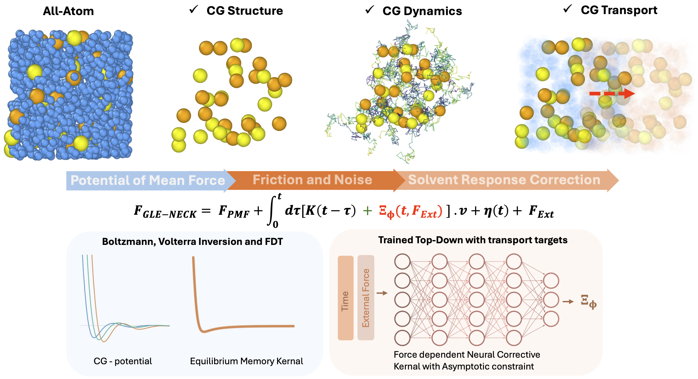
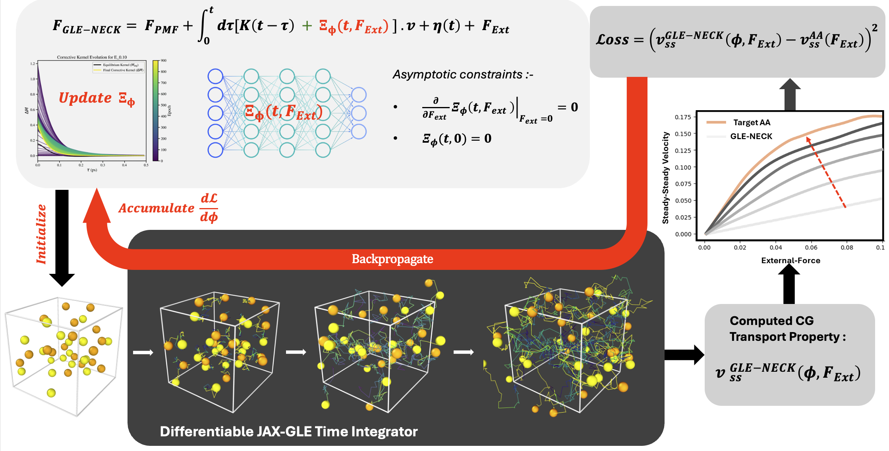

# GLE-NECK

**Generalized Langevin Equation with Non-Equilibrium Corrective Kernels**

[](https://www.python.org/)
[](LICENSE)
[](#status)

<p align="center">
  
</p>

## Overview

GLE-NECK is a differentiable coarse-grained transport workflow for learning **non-equilibrium corrections to an equilibrium generalized Langevin equation (GLE)**.

Equilibrium coarse-graining can preserve structure through an effective potential and can preserve equilibrium dynamics through a memory/noise pair. Transport under external driving is harder. When solvent degrees of freedom are removed, their **field-dependent response** is removed as well. Simply applying an external force to an equilibrium GLE assumes that the eliminated solvent remains an equilibrium bath, which can give the wrong mobility or drift response.

GLE-NECK addresses this by keeping the equilibrium GLE fixed and learning only the missing non-equilibrium response as a **field-conditioned corrective memory kernel**.

This public repository contains the **bulk binary-solute transport system** used to demonstrate the method. It includes processed artifacts, plotting utilities, reproducibility checks, tests, and minimal run scripts for figure generation. Raw trajectories, exploratory notebooks, scheduler logs, failed architecture sweeps, and draft thesis material are intentionally excluded.

---

## Core idea

The equilibrium retained-solute GLE is first constructed from all-atom reference data:

- a conservative PMF/IBI interaction is obtained from retained-solute RDF targets,
- the equilibrium memory kernel is reconstructed from the all-atom VACF,
- colored noise is generated consistently with the equilibrium memory kernel,
- the resulting baseline GLE is validated against equilibrium RDF/VACF behavior.

GLE-NECK then augments this equilibrium model with a learned non-equilibrium correction.

With the sign convention used here, the retained-solute dynamics are written schematically as

```math
m\dot{\mathbf v}(t)
=
\mathbf F_{\mathrm{PMF}}(\mathbf R(t))
+
\mathbf F_{\mathrm{ext}}
-
\int_0^t d\tau\,
\left[
\mathbf K_{\mathrm{eq}}(t-\tau)
+
\boldsymbol{\Xi}_{\phi}(t-\tau,\mathbf F_{\mathrm{ext}})
\right]
\mathbf v(\tau)
+
\boldsymbol{\eta}_{\mathrm{eq}}(t).
```

Here:

- $\mathbf F_{\mathrm{PMF}}$ is the equilibrium conservative force,
- $\mathbf K_{\mathrm{eq}}$ is the equilibrium memory kernel,
- $\boldsymbol{\eta}_{\mathrm{eq}}$ is the corresponding equilibrium colored noise,
- $\mathbf F_{\mathrm{ext}}$ is the applied external field,
- $\boldsymbol{\Xi}_{\phi}$ is the learned non-equilibrium corrective kernel.

The correction is constrained to vanish in the zero-field limit:

```math
\boldsymbol{\Xi}_{\phi}(\tau,\mathbf F_{\mathrm{ext}})
=
\|\mathbf F_{\mathrm{ext}}\|^2
\mathcal N_{\phi}(\tau,\mathbf F_{\mathrm{ext}}),
\qquad
\boldsymbol{\Xi}_{\phi}(\tau,\mathbf 0)=\mathbf 0.
```

Thus, GLE-NECK does not overwrite the audited equilibrium GLE. It learns a finite-field correction that activates only under external driving.


---

## Model construction

<p align="center">
  
</p>

The workflow separates equilibrium coarse-graining from transport correction:

1. **Equilibrium structure**  
   Compute retained-solute RDFs from explicit-solvent all-atom simulations.

2. **Conservative interaction**  
   Invert RDF targets to obtain tabulated PMF/IBI conservative interactions.

3. **Equilibrium dynamics**  
   Compute the retained-solute VACF and reconstruct the equilibrium memory kernel.

4. **Equilibrium GLE validation**  
   Validate the baseline GLE against RDF and VACF targets.

5. **Non-equilibrium transport data**  
   Run explicit-solvent driven simulations and compute steady-state drift velocities.

6. **Corrective-kernel training**  
   Learn $\boldsymbol{\Xi}_{\phi}$ through differentiable GLE simulation using drift-velocity loss.

7. **Transport validation**  
   Compare GLE-NECK mobility predictions against all-atom reference mobilities.

---

## Differentiable training

<p align="center">
  
</p>

The corrective kernel is trained top-down on transport observables. For a corrective-kernel parameter vector $\phi$ and external field $F$, the differentiable GLE integrator produces a trajectory and a steady-state drift estimate:

```math
v_{\mathrm{ss}}^{\mathrm{GLE\text{-}NECK}}(\phi,F)
=
\mathcal S_T
\left[
\mathbf R_t,\mathbf v_t;
\mathbf F_{\mathrm{PMF}},
\mathbf K_{\mathrm{eq}},
\boldsymbol{\eta}_{\mathrm{eq}},
\boldsymbol{\Xi}_{\phi},
F
\right],
```

where $\mathcal S_T$ denotes GLE time integration followed by a steady-state velocity estimator.

For training fields $\mathcal E_{\mathrm{train}}$, the loss is

```math
\mathcal L(\phi)
=
\frac{1}{|\mathcal E_{\mathrm{train}}|}
\sum_{F\in\mathcal E_{\mathrm{train}}}
\left[
v_{\mathrm{ss}}^{\mathrm{GLE\text{-}NECK}}(\phi,F)
-
v_{\mathrm{ss}}^{\mathrm{AA}}(F)
\right]^2
+
\lambda\,\mathcal R(\phi).
```

In the promoted bulk result,

```math
\mathcal E_{\mathrm{train}}=\{0.5,1.0,2.0\}.
```

Single-point training is retained as a diagnostic baseline. Multi-point training is the promoted model because it learns a shared field-conditioned correction across the transport curve.

---

## Results

The public figure-generation pipeline reproduces the bulk transport figures from processed artifacts:

```bash
python scripts/make_bulk_figures.py --all
```

Expected outputs include:

- equilibrium RDF/VACF checks,
- reconstructed memory kernels,
- single-point training diagnostics,
- multi-point training diagnostics,
- corrective-kernel evolution,
- mobility comparison curves,
- held-out mobility loss summaries.

Generated figures are written to:

```text
figures/bulk/
```

---

## Installation

Clone the repository and install the package in editable mode:

```bash
git clone https://github.com/ishannadkarni1997/GLE-NECK.git
cd GLE-NECK

python3 -m venv .venv
. .venv/bin/activate

python -m pip install --upgrade pip
python -m pip install -e '.[dev]'
```

For differentiable simulations and training, install the optional JAX stack in an environment appropriate for your CPU/GPU platform:

```bash
python -m pip install -e '.[dev,jax]'
```

---

## Reproducibility

Regenerate all public bulk figures:

```bash
python scripts/make_bulk_figures.py --all
```

Run artifact checks:

```bash
python scripts/check_bulk_reproducibility.py
```

Run tests:

```bash
pytest
```

Installed entry points:

```bash
gleneck-bulk-figures --all
gleneck-bulk-check
```

---

## Repository layout

```text
src/gleneck/                 reusable Python package
scripts/                     public command-line workflows
configs/                     locked bulk run configuration
data/processed/bulk/         compact processed artifacts
figures/bulk/                generated public figures
docs/                        method notes, units, provenance, and cluster notes
examples/                    minimal reproduction workflow
slurm/                       generic GPU job template
tests/                       artifact, plotting, and hygiene tests
```

---

## What is included

This repository includes:

- processed bulk artifacts,
- plotting and figure-generation scripts,
- minimal reproduction workflows,
- locked public configuration files,
- lightweight tests and artifact checks,
- documentation for units, provenance, and public run assumptions.

## What is not included

This repository does not include:

- raw all-atom trajectories,
- raw CG/GLE trajectory dumps,
- exploratory notebooks,
- failed architecture sweeps,
- scheduler logs,
- unpublished thesis drafts,
- private analysis notes.

The repository is intentionally compact so that public figures and checks can be reproduced without distributing large raw simulation files.

---

## Status

This is research code associated with an ongoing thesis/manuscript project. The public release is designed for reproducibility of the **bulk GLE-NECK artifact pipeline**, not as a general-purpose molecular dynamics engine.

Known scope boundaries:

- the public release focuses on the bulk binary-solute system,
- confined-system workflows are not included in this repository,
- raw simulation trajectories are not distributed,
- the learned corrective kernel is intended as a transport-targeted effective response, not a unique microscopic projection-operator object.

---

## Citation

If this code is useful, please cite the associated manuscript when available.

---

## License

This project is released under the MIT License. See [`LICENSE`](LICENSE).
